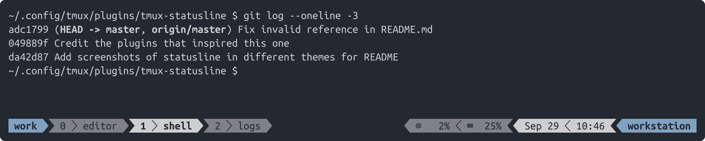
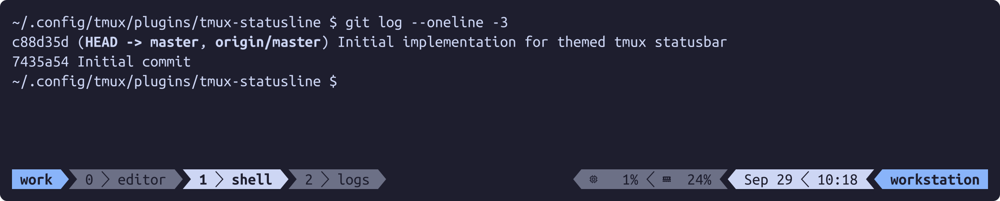
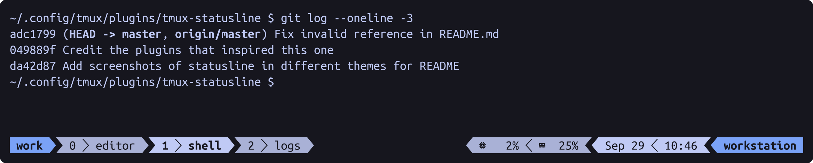
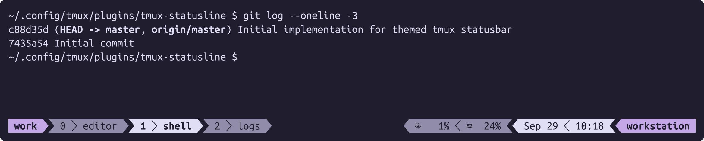
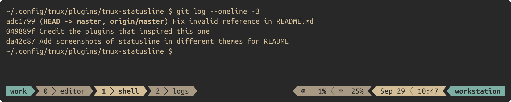

# tmux-statusline

A configurable, Powerline-style status bar for [tmux](https://github.com/tmux/tmux),
shipping with different ready-to-use themes (Nightfox, Catppuccin, TokyoNight,
Rosé Pine and Gruvbox variants).

Every part of the status bar — separators, indicators and the content of each
right-hand section — is driven by regular tmux options, so it can be tailored from
`tmux.conf` without touching the plugin itself.

## Screenshots

Captured from a real tmux session with the default configuration — session name,
window list, CPU and memory in section x, date and time in section y, and the
hostname in section z. `nordfox` is the theme the plugin uses by default; the
other families are shown with their default variant.

**Nordfox** (default)



**Catppuccin**



**TokyoNight**



**Rosé Pine**



**Gruvbox**



Regenerate them with `python3 scripts/make-screenshots.py` (requires `pyte`,
`fonttools`, `cairosvg` and a Nerd Font). Each theme is rendered in its own tmux
server, so options never leak between captures.

## Layout

```
┌──────────┬───────────────────┬───────────────────────────────────────────┐
│ section  │ window list       │ section x     │ section y     │ section z │
│    a     │                   │ (system info) │ (date, time)  │ (host)    │
└──────────┴───────────────────┴───────────────────────────────────────────┘
 status-left                                                   status-right
```

- **Section a** (`status-left`) shows the session name. It changes colour to signal
  the current mode: `accent_color` normally, `active_color` while the prefix key is
  pending, and `copy_color` while in copy mode.
- **Window list** shows `index │ name`, plus a marker when a pane is zoomed.
- **Sections x / y / z** (`status-right`) are configurable field lists; see
  [Sections](#sections).

## Requirements

- tmux 3.0 or newer
- `bash` (the plugin scripts are sourced by TPM, which already uses bash)
- A [Nerd Font](https://www.nerdfonts.com/) for the default separators and the
  CPU/memory icons. Without one, override the glyphs as shown in
  [Configuration](#configuration).
- `/proc/stat`, `free`, and `/sys/class/power_supply/BAT*/capacity` for the CPU,
  memory, and battery fields (Linux). On other platforms, replace those fields
  with your own commands.

## Installation

### With [TPM](https://github.com/tmux-plugins/tpm) (recommended)

Add the plugin to `~/.config/tmux/tmux.conf`:

```tmux
set -g @plugin 'rlamote/tmux-statusline'
```

Then press `prefix + I` to install it.

### Manual

```sh
git clone https://github.com/rlamote/tmux-statusline \
    ~/.config/tmux/plugins/tmux-statusline
```

And add this near the bottom of `~/.config/tmux/tmux.conf`:

```tmux
run '~/.config/tmux/plugins/tmux-statusline/tmux-statusline.tmux'
```

## Configuration

All options must be set **before** the plugin is loaded (i.e. above the `run` line
of TPM or of the plugin itself).

| Option | Default | Description |
| --- | --- | --- |
| `@tmux-statusline-theme` | `nordfox` | Theme name, matching a file in `themes/` |
| `@tmux-statusline-section-separator-left` | `` (U+E0B0) | Separator between left-aligned sections |
| `@tmux-statusline-section-separator-right` | `` (U+E0B2) | Separator between right-aligned sections |
| `@tmux-statusline-field-separator-left` | `` (U+E0B1) | Separator between fields in left-aligned sections |
| `@tmux-statusline-field-separator-right` | `` (U+E0B3) | Separator between fields in right-aligned sections |
| `@tmux-statusline-zoomed-symbol` | ` +` | Marker appended to a window name when a pane is zoomed |
| `@tmux-statusline-cpu-status` | `on` | Include the bundled CPU field in section x |
| `@tmux-statusline-memory-status` | `on` | Include the bundled memory field in section x |
| `@tmux-statusline-battery-status` | `off` | Include the bundled battery field in section x |
| `@tmux-statusline-section-x-fields` | built from the toggles above | Fields of section x |
| `@tmux-statusline-section-y-fields` | `%b %d,%H:%M` | Fields of section y |
| `@tmux-statusline-section-z-fields` | `#h` | Fields of section z |

Example:

```tmux
set -g @plugin 'rlamote/tmux-statusline'
set -g @tmux-statusline-theme 'tokyonight-storm'
set -g @tmux-statusline-zoomed-symbol ' [Z]'
set -g @tmux-statusline-section-y-fields '%Y-%m-%d,%H:%M:%S'
```

### Sections

tmux options can only hold a single string, so field lists are written as
**comma-separated** values. Each field may be any
[tmux format string](https://man7.org/linux/man-pages/man1/tmux.1.html#FORMATS),
including `#(command)` substitutions, which are re-run every `status-interval`
(5 seconds by default).

```tmux
# Three fields in section y: week number, date and time
set -g @tmux-statusline-section-y-fields 'W%V,%b %d,%H:%M'

# Show the battery level next to the hostname
set -g @tmux-statusline-section-z-fields '#(~/bin/battery.sh),#h'
```

The bundled battery field is opt-in:

```tmux
set -g @tmux-statusline-battery-status 'on'
```

Likewise, the CPU and memory fields can be switched off:

```tmux
set -g @tmux-statusline-cpu-status 'off'
set -g @tmux-statusline-memory-status 'off'
```

These toggles accept `on`/`off` (`true`/`false`, `yes`/`no` and `1`/`0` also work)
and only build the *default* value of `@tmux-statusline-section-x-fields`. Setting
that option explicitly replaces the list entirely and ignores the toggles:

```tmux
# Toggles no longer apply: this is the literal field list
set -g @tmux-statusline-section-x-fields '#(~/bin/vpn.sh),#(~/bin/weather.sh)'
```

Because a comma separates fields, a field cannot itself contain a comma. If you need
one, move the logic into a small script and reference it with `#(…)`, as the bundled
CPU and memory fields do.

Setting a section to an empty string removes that section — separators and colours
included — from the status bar:

```tmux
# Hide the system-information section entirely
set -g @tmux-statusline-section-x-fields ''
```

Switching every bundled field off has the same effect on section x.

> **Note**
> tmux never forgets an option: deleting a `set -g @tmux-statusline-…` line from
> `tmux.conf` and reloading keeps the previously applied value in the running
> server. To go back to the default, unset it explicitly with
> `tmux set-option -gu @tmux-statusline-section-x-fields` (or restart the server).

## Themes

Set one with `@tmux-statusline-theme`:

The family name selects its default variant, so `gruvbox` is sufficient unless you
want a specific variant such as `gruvbox-dark-soft`.

| Family | Default | Variants |
| --- | --- | --- |
| [Nightfox](https://github.com/EdenEast/nightfox.nvim) | `nightfox` | `nightfox`, `dayfox`, `dawnfox`, `duskfox`, `nordfox`, `terafox`, `carbonfox` |
| [Catppuccin](https://github.com/catppuccin/catppuccin) | `catppuccin` → `catppuccin-mocha` | `catppuccin-latte`, `catppuccin-frappe`, `catppuccin-macchiato`, `catppuccin-mocha` |
| [TokyoNight](https://github.com/folke/tokyonight.nvim) | `tokyonight` → `tokyonight-night` | `tokyonight-night`, `tokyonight-storm`, `tokyonight-moon`, `tokyonight-day` |
| [Rosé Pine](https://github.com/rose-pine/neovim) | `rose-pine` | `rose-pine`, `rose-pine-moon`, `rose-pine-dawn` |
| [Gruvbox Material](https://github.com/sainnhe/gruvbox-material) | `gruvbox` → `gruvbox-dark` | `gruvbox-dark`, `gruvbox-dark-hard`, `gruvbox-dark-soft`, `gruvbox-light` |

Family defaults are relative symbolic links in `themes/`. This keeps theme loading
file-based and lets Linux/WSL users add a family without modifying plugin code.

### Writing a theme

A theme is a shell-compatible file in `themes/<name>.conf` with two parts: the full
upstream palette, and the seven colours the status bar actually consumes.

```sh
##########################
# mytheme palette
##########################

bg0="#232831"
fg1="#cdcecf"
fg3="#7e8188"
blue0="#81a1c1"
yellow0="#ebcb8b"
bg4="#5a657d"

##########################
# mytheme theme colors
##########################

bg_color="$bg0"         # status bar background
text_color="$fg1"       # default text
accent_color="$blue0"   # session name, section z, pane borders
active_color="$fg1"     # current window, section y
inactive_color="$fg3"   # other windows, section x
border_color="$bg4"     # inactive pane borders
copy_color="$yellow0"   # copy mode
```

Drop the file into `themes/`, then select it with
`set -g @tmux-statusline-theme 'mytheme'`.

For a family with multiple variants, create a relative symbolic link for its
default:

```sh
cd themes
ln -s mytheme-dark.conf mytheme.conf
```

The family can then be selected as `mytheme`, while `mytheme-dark` and other
variants remain available explicitly. Always use a relative target so the link
continues to work when the plugin directory moves.

## Project layout

```
tmux-statusline.tmux     # TPM entry point: loads the theme, applies the status bar
scripts/
  helpers.sh             # get_tmux_option, join_by
  colorscheme.sh         # load_theme, colour overrides
  status.sh              # builds and applies every status-bar option
  cpu.sh                 # CPU usage field
  memory.sh              # memory usage field
  battery.sh             # battery capacity field
  make-screenshots.py    # renders the README screenshots from real tmux servers
themes/                  # theme files and family-default symbolic links
screenshots/             # README screenshots, one PNG per theme
```

## Acknowledgements

This plugin was inspired by:

- [idossha/tmux-nightfox](https://github.com/idossha/tmux-nightfox) — Nightfox
  colour themes for tmux
- [binoymanoj/tmux-minimal-theme](https://github.com/binoymanoj/tmux-minimal-theme)
  — a minimal, configurable tmux status bar

Both are MIT-licensed.

The bundled palettes come from the upstream colour schemes they are named after:
[Nightfox](https://github.com/EdenEast/nightfox.nvim),
[Catppuccin](https://github.com/catppuccin/catppuccin),
[TokyoNight](https://github.com/folke/tokyonight.nvim),
[Rosé Pine](https://github.com/rose-pine/neovim) and
[Gruvbox Material](https://github.com/sainnhe/gruvbox-material).

## License

[MIT](LICENSE)
